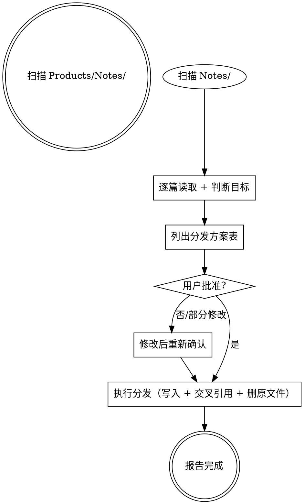

# Ingest - Products/Notes 分发入库

> **核心原则：先列方案，等批准，再执行。禁止自行创建、移动或删除任何文件。**



---

## 第一步：扫描

扫描以下目录所有 `.md` 文件（排除 `_` 开头）：`Products/Notes/Inbox/`、`Products/Notes/Clippings/`、`Products/Notes/Conversation/`

---

## 第二步：逐篇读取并判断

对每篇：Read 读取全文 → 生成摘要 → 按下表判断分发目标：

| 内容特征 | 分发目标 |
|---|---|
| 软件工具、CLI、配置、代码技巧 | `Products/Software/Resources/`（按工具归入现有子目录） |
| 软件开发思考、AI 产品想法 | `Products/Software/Products/` |
| SaaS 产品、项目构想 | `Products/Software/Products/` |
| 投资、股票、期权、加密货币、美债 | `Products/LifeOS/Investment/` |
| 保险 | `Products/LifeOS/Insurance/` |
| 健身、健康、饮食 | `Products/LifeOS/Health/` |
| 英语学习 | `Products/LifeOS/English/` |
| 个人信息、账户、公司、移民 | `Products/LifeOS/Memos/` |
| AI、工具方法、OpenClaw 研究 | `Products/Knowledge/AI/` 或其现有子目录 |
| 历史主题 | `Products/Knowledge/History/` |
| 地图、地缘、空间信息 | `Products/Knowledge/Maps/` |
| 方法论、思维模型、读书笔记、管理、创业、社交、教育等通用研究内容 | `Products/Knowledge/Research/` |
| 内容创作方法论、写作知识、运营策略、SOP | `Products/Writing/Operation/` |
| 选题灵感、视频/文章素材 | `Products/Writing/Notes/` |
| 无法判断 | 留在 `Products/Notes/`，标记"待用户决定" |

**一篇一个主目标。** 判断目标后搜索该目录是否有高度相关文件，有则建议**合并**，无则建议**新建**。

---

## 第三步：列出分发方案，等待批准

```
| # | 文件 | 建议目标 | 处理方式 | 理由 |
```

**禁止跳过此步骤。必须等用户说"确认/批准/OK/好"之后才执行。**

---

## 第四步：执行分发

### 4.1 写入目标文件

**新建文件** frontmatter：

```yaml
---
title: 文章标题
source: https://原始链接（无则省略）
ingested: YYYY-MM-DD
origin: Products/Notes/原文件名.md
tags: [关键词1, 关键词2]
---
```

**Tag 合法性（写入前必须检查）：** 只允许字母（含中文）、数字、`-`、`_`、`/`。空格/点号 → `-`，其他特殊符号 → 删除，纯数字 → 加前缀（`2026` → `year-2026`）。

**合并到已有文件：** 新内容追加到合适位置，更新 tags，不覆盖已有内容。

### 4.2 建立交叉引用

在目标目录搜索强关联文件。发现强关联时（内容互补、理论与实践配对、读书笔记与应用配对）：
- 新文件末尾添加 `## 相关页面` + `- [[对方路径]]`
- 已有文件的 `## 相关页面` 追加 `- [[新文件路径]]`
- 路径相对于所在 Vault 根目录，必须双向
- **Archives 例外：** `Writing/Archives/` 只读，只允许单向链接指向它，不得修改 Archives 文件

### 4.3 删除原文件

分发完成后删除 `Products/Notes/` 中的原始文件。逐篇报告进度。

---

## 第五步：完成报告

```
**Ingest 完成：** 处理 N 篇 | 新建 X | 合并 Y | 跳过 Z | 新增交叉引用 M 条
```

---

## 红线

- **禁止** 不列方案就直接操作文件
- **禁止** 用户未确认就创建/删除文件
- **禁止** 分发后不删除 `Products/Notes/` 原文件（用户确认保留的除外）
- **禁止** 新建文件缺少 frontmatter
- **禁止** 只做单向链接（Archives 例外除外）
