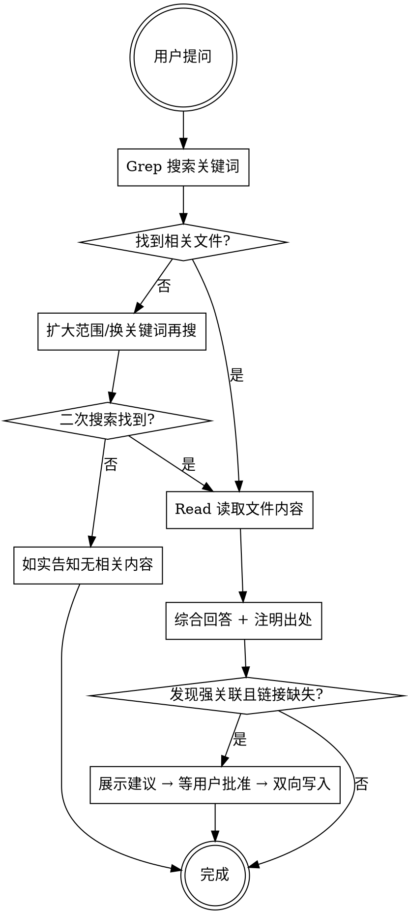

# Query - 知识库查询

> **核心原则：禁止直接用训练数据回答。必须先搜索知识库，基于搜索结果综合回答。**



---

## 第一步：判断搜索范围

| 问题涉及 | 搜索目录 |
|---|---|
| 管理、领导力、团队、职业发展 | `Products/Knowledge/Research/` |
| 创业、产品、用户增长 | `Products/Knowledge/Research/` 或 `Products/Software/Products/` |
| 乔布斯、苹果、AI、OpenClaw、工具方法 | `Products/Knowledge/AI/` 及其现有子目录 |
| 历史主题 | `Products/Knowledge/History/` |
| 地图、地缘、空间信息 | `Products/Knowledge/Maps/` |
| 读书笔记、人生哲学、时间管理、沟通、社交、教育等通用研究内容 | `Products/Knowledge/Research/` |
| AI 工具、Claude Code、软件工具 | `Products/Software/Resources/` |
| 软件开发思考、AI 产品 | `Products/Software/Products/` |
| 投资、股票、期权、加密货币 | `Products/LifeOS/Investment/` |
| 保险 | `Products/LifeOS/Insurance/` |
| 健身、健康 | `Products/LifeOS/Health/` |
| 内容创作方法论 | `Products/Writing/Operation/` |
| 不确定 | 在整个 `Products/` 目录搜索 |

问题可能跨多领域时，搜索所有相关目录。

---

## 第二步：搜索并阅读

1. Grep 搜索关键词（尝试多个同义词）；Glob 按文件名匹配
2. Read 读取相关文件完整内容
3. 首轮未找到 → 换同义词或扩大到相邻目录再搜一轮
4. **至少读取 2 个相关文件再回答**，只找到 1 个须明确说明

---

## 第三步：综合回答

```
[基于知识库内容的综合回答]

**来源：**
- [[文件路径1]] — 要点摘要
- [[文件路径2]] — 要点摘要
```

每个观点必须标注来源文件。知识库无相关内容时如实说明，可用通用知识补充但必须明确标注。

---

## 第四步：反哺交叉引用

回答完成后必须执行，不可跳过。

**判断强关联：** 对本次读取的所有文件两两比对，符合以下任一条件则为强关联：内容互补、理论与实践配对、读书笔记与应用配对、人物与方法论配对。仅主题相近但无实质互补不算。

**检查并建链（用户批准后执行）：**
- 若文件末尾已有 `## 相关页面` → 追加 `- [[对方路径]]`
- 若没有 → 在文件末尾新增 `## 相关页面` 段落
- 路径相对于所在 Vault 根目录
- 必须双向：A 链接 B，B 也链接 A
- **Archives 例外：** `Products/Writing/Archives/` 只读，只在非 Archives 一方添加单向链接

未发现强关联时一句话告知即可。

---

## 红线

- **禁止** 不搜索就回答
- **禁止** 只看文件名不读内容
- **禁止** 回答不注明出处
- **禁止** 把训练数据混入回答却标注为知识库来源
- **禁止** 未经用户批准就修改文件
